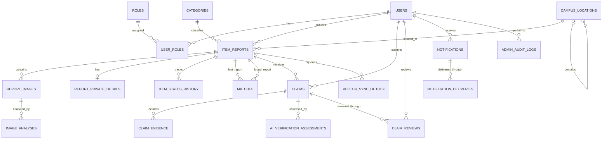

# LostLink — Entity Relationship Diagram

```mermaid
erDiagram
    USERS ||--o{ USER_ROLES : has
    ROLES ||--o{ USER_ROLES : assigned
    USERS ||--o{ ITEM_REPORTS : submits
    CATEGORIES ||--o{ ITEM_REPORTS : classifies
    CAMPUS_LOCATIONS ||--o{ ITEM_REPORTS : located_at
    CAMPUS_LOCATIONS o|--o{ CAMPUS_LOCATIONS : contains
    ITEM_REPORTS ||--o{ REPORT_IMAGES : contains
    REPORT_IMAGES ||--o{ IMAGE_ANALYSES : analyzed_by
    ITEM_REPORTS ||--o| REPORT_PRIVATE_DETAILS : has
    ITEM_REPORTS ||--o{ ITEM_STATUS_HISTORY : tracks
    ITEM_REPORTS ||--o{ MATCHES : lost_report
    ITEM_REPORTS ||--o{ MATCHES : found_report
    USERS ||--o{ CLAIMS : submits
    ITEM_REPORTS ||--o{ CLAIMS : receives
    CLAIMS ||--o{ CLAIM_EVIDENCE : includes
    CLAIMS ||--o{ AI_VERIFICATION_ASSESSMENTS : assessed_by
    CLAIMS ||--o{ CLAIM_REVIEWS : reviewed_through
    USERS ||--o{ CLAIM_REVIEWS : reviews
    USERS ||--o{ NOTIFICATIONS : receives
    NOTIFICATIONS ||--o{ NOTIFICATION_DELIVERIES : delivered_through
    USERS ||--o{ ADMIN_AUDIT_LOGS : performs
    ITEM_REPORTS ||--o{ VECTOR_SYNC_OUTBOX : queues
```
